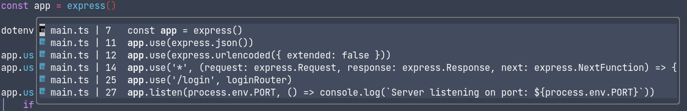

# nice-reference.nvim
A small neovim plugin to see LSP references in a popup window under the cursor.



## Install
Requires neovim > 0.5.0, install it with your favorite plugin manager

```lua
use { 
    'wiliamks/nice-reference.nvim', 
    requires = { 
        'kyazdani42/nvim-web-devicons' --optional
        { 'rmagatti/goto-preview', config = function() require('goto-preview').setup {} end } --optional
    } 
}
```

#### Optional dependencies
[nvim-web-devicons](https://github.com/kyazdani42/nvim-web-devicons/) - For icons
require('goto-preview').setup {}

[goto-preview](https://github.com/rmagatti/goto-preview) - For previewing in a floating window

## Setup

This plugin doesn't require calling the setup function, so you just need to call it if you wanto to customize it.

```lua
require 'nice-reference'.setup({
    anchor = "NW", -- Popup position anchor
    relative = "cursor", -- Popup relative position
    row = 1, -- Popup x position
    col = 0, -- Popup y position
    border = "rounded", -- Popup borderstyle
    winblend = 0, -- Popup transaparency 0-100, where 100 is transparent
    max_width = 120, -- Max width of the popup
    max_height = 10, -- Max height of the popup
    auto_choose = false, -- Go to reference if there is only one
})
```

Then just map it to a keybind using the command
```vim
nnoremap <silent> gr <cmd>NiceReference<CR>
```

Or the lua function
```lua
vim.api.nvim_set_keymap("n", "gr", "<cmd>lua require('nice-reference').references()<CR>")
```

or you can just use a handler instead
```lua
vim.lsp.handlers["textDocument/references"] = require 'nice-reference'.reference_handler
```

### Mappings on the popup

| key    | function                                                      |
|--------|---------------------------------------------------------------|
| Enter  | Go to reference under the cursor                              |
| Escape | Exits the popup                                               |
| q      | Exits the popup                                               |
| Ctrl+c | Exits the popup                                               |
| p      | Preview reference in a floating window(requires goto-preview) |
